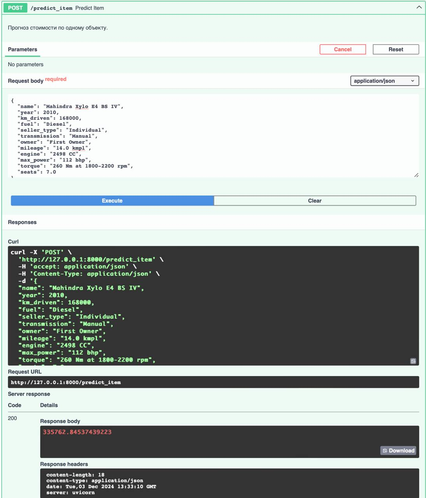
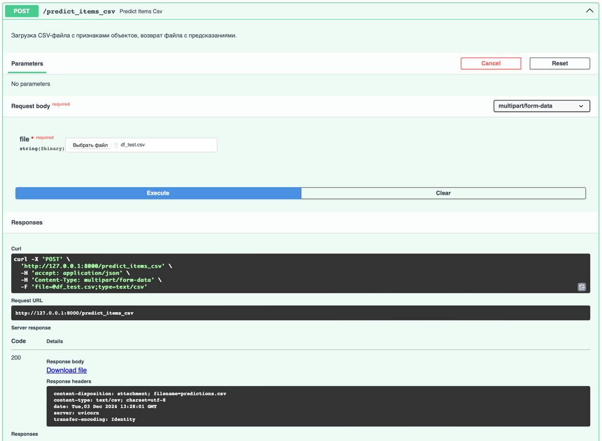
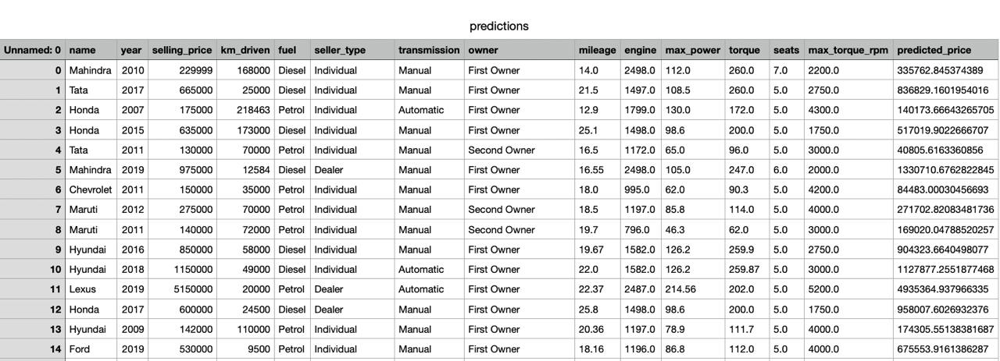
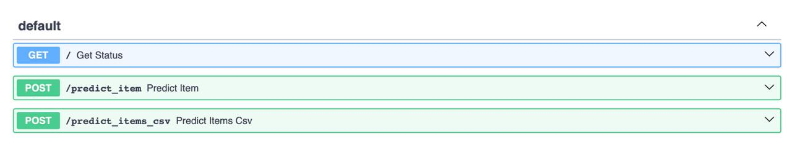

# Car Price Prediction Service

## Описание
Этот проект представляет собой FastAPI-сервис, который выполняет предсказания стоимости автомобилей на основе предоставленных данных.

## Функциональность
1. Прогноз стоимости по одному автомобилю  
   Отправьте JSON с характеристиками одного автомобиля, чтобы получить предсказанную стоимость.
2. Прогноз стоимости для нескольких автомобилей из CSV-файла  
   Загрузите CSV-файл с характеристиками автомобилей, чтобы получить файл с предсказаниями.

## Установка
1. Клонируйте репозиторий:
   ```bash
   git clone https://github.com/sal0m/HSE_ML_hw1.git
   cd HSE_ML_hw1
2. Установите зависимости:
   ```bash
    pip install -r requirements.txt

## Запуск
   ```bash
   uvicorn car_price_api:app --reload
```

## Использование
1.  Прогноз по одному объекту
- эндпоинт POST /predict_item

Пример использования:


2.  Прогноз по нескольким объектам в csv файле 
- эндпоинт POST /predict_items

Пример использования:


Пример ответа:


## Тестирование

Для тестирования ендпоинтов можно использовать Swagger UI, доступный по адресу:

**http://127.0.0.1:8000/docs**





